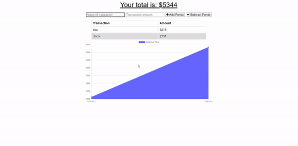

# Budget-Tracker

 * Small node.js and mongodb app that allows users to track transactions with, or without internet access. All data is saved wether internet is accessible or not.

 ## Demo 
 

 ## Contributors
 
 * Jacob Duden

 ## Links 

 [GitHub Page](https://github.com/jacobduden/Budget-Tracker)

 [Heroku Link](https://jldbudgettracker.herokuapp.com/)